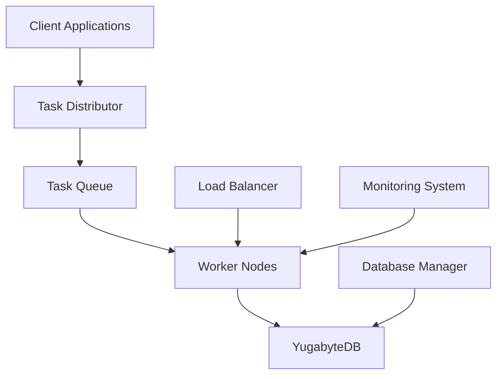

# Distributed Task Queue System
[](https://isocpp.org/)
[](https://pocoproject.org/)
[](https://www.yugabyte.com/)

## Table of Contents
1. [Project Overview](#project-overview)
2. [System Architecture](#system-architecture)
3. [Technical Requirements](#technical-requirements)
4. [Installation & Setup](#installation--setup)
5. [Database Configuration](#database-configuration)
6. [Building & Running](#building--running)
7. [Core Components](#core-components)
8. [Usage Examples](#usage-examples)
9. [Performance Optimization](#performance-optimization)
10. [Monitoring & Metrics](#monitoring--metrics)
11. [Troubleshooting Guide](#troubleshooting-guide)
12. [Contributing](#contributing)

## Project Overview

The Distributed Task Queue System is a high-performance, fault-tolerant distributed computing framework designed for processing large-scale workloads across multiple worker nodes. Built with modern C++ and leveraging Poco C++ Libraries, it provides enterprise-grade task distribution with automatic load balancing and real-time monitoring.

### Key Features

- **Distributed Processing**: Seamless task distribution across worker nodes
- **Priority-based Scheduling**: Intelligent task prioritization
- **Fault Tolerance**: Automatic recovery and failover mechanisms
- **Real-time Monitoring**: Comprehensive performance tracking
- **Horizontal Scalability**: Dynamic worker node scaling
- **Database Persistence**: Reliable storage using YugabyteDB
- **Load Balancing**: Adaptive workload distribution
- **High Availability**: No single point of failure

## System Architecture

### Component Overview



## Technical Requirements

### Hardware Requirements
- **CPU**: 4+ cores (8+ recommended for production)
- **RAM**: 8GB minimum (16GB+ recommended)
- **Storage**: 50GB+ SSD recommended
- **Network**: High-speed connectivity (1Gbps+)

### Software Requirements
- **Compiler**: C++17 compatible (GCC 7.3+ or Clang 6.0+)
- **Build System**: CMake 3.10+
- **Database**: YugabyteDB 2.23.0+
- **Libraries**:
  - Poco C++ Libraries 1.9.0+
  - OpenSSL 1.1.1+
  - PostgreSQL development libraries
  - Boost 1.65+ (optional)

## Installation & Setup

### Ubuntu/Debian Setup

```bash
# Install essential packages
sudo apt update && sudo apt install -y \
    build-essential \
    cmake \
    git \
    libpoco-dev \
    libssl-dev \
    postgresql-server-dev-all

# Install YugabyteDB
wget https://downloads.yugabyte.com/releases/2.23.0.0/yugabyte-2.23.0.0-b710-linux-x86_64.tar.gz
tar xvfz yugabyte-2.23.0.0-b710-linux-x86_64.tar.gz
cd yugabyte-2.23.0.0/
```

### Windows Setup with WSL

```powershell
# In PowerShell as Administrator
wsl --install

# After restart, follow Ubuntu/Debian setup in WSL
```

### Project Structure

```
.
├── build                   # Build output directory
├── CMakeLists.txt         # CMake build configuration
├── include                # Header files
│   ├── DatabaseManager.h  # Database interaction layer
│   ├── LoadBalancer.h     # Load distribution logic
│   ├── TaskClient.h       # Client interface
│   ├── TaskDistributor.h  # Task distribution system
│   ├── Task.h            # Task definition and states
│   ├── TaskQueue.h       # Queue management
│   ├── Worker.h          # Worker interface
│   └── WorkerNode.h      # Worker node implementation
├── src                    # Implementation files
│   └── [Implementation files]
└── tests                  # Test suite
```

## Database Configuration

### YugabyteDB Setup

```bash
# Start YugabyteDB
./bin/yugabyted start
./bin/yugabyted status
./bin/yb-ctl start  # For creating cluster

# Create Database and User
./bin/ysqlsh -h 127.0.1.1 -p 5433 -U yugabyte

# In ysqlsh prompt:
CREATE DATABASE taskqueue1;
CREATE USER yugabyte WITH PASSWORD 'yugabyte';
GRANT ALL PRIVILEGES ON DATABASE taskqueue1 TO yugabyte;
```

### Schema Configuration

```sql
-- Core schema
CREATE TABLE tasks (
    id UUID PRIMARY KEY,
    name TEXT NOT NULL,
    priority INTEGER DEFAULT 1,
    status TEXT NOT NULL,
    data JSONB,
    created_at TIMESTAMP WITH TIME ZONE DEFAULT CURRENT_TIMESTAMP,
    updated_at TIMESTAMP WITH TIME ZONE DEFAULT CURRENT_TIMESTAMP,
    completed_at TIMESTAMP WITH TIME ZONE,
    worker_id UUID,
    retries INTEGER DEFAULT 0,
    max_retries INTEGER DEFAULT 3
);

-- Indexes for performance
CREATE INDEX idx_tasks_status ON tasks(status);
CREATE INDEX idx_tasks_priority ON tasks(priority);
```

## Building & Running

### Building the Project

```bash
# Clone repository
git clone https://github.com/shibbu04/distributed-task-queue.git
cd distributed-task-queue

# Build
mkdir build && cd build
cmake ..
make -j$(nproc)

# Run tests
ctest --output-on-failure
```

### Running the System

```bash
# Start YugabyteDB (if not running)
cd yugabyte-2.23.0.0/
./bin/yugabyted start

# Start Task Server
./TaskQueueServer

# Start Worker Nodes (multiple terminals)
./WorkerNode
```

## Core Components

### Task Distributor
```cpp
class TaskDistributor {
public:
    TaskDistributor(uint16_t port);
    UUID submitTask(const Task& task);
    TaskStatus getTaskStatus(const UUID& taskId);
private:
    std::unique_ptr<TaskQueue> queue;
    std::unique_ptr<LoadBalancer> loadBalancer;
};
```

### Worker Implementation
```cpp
class CustomWorker : public Worker {
public:
    void processTask(const Task& task) override {
        std::cout << "Processing task: " << task.getId() << std::endl;
        updateProgress(task.getId(), 50);
        completeTask(task.getId());
    }
};
```

## Performance Optimization

### Load Balancing Strategies
1. **Round-Robin**: Simple task distribution
2. **Least Connections**: Based on current worker load
3. **Weighted Response Time**: Considers worker performance
4. **Resource-Aware**: CPU and memory usage based

### Database Optimization

```sql
-- Performance tuning
ALTER SYSTEM SET max_connections = 200;
ALTER SYSTEM SET shared_buffers = '2GB';
ALTER SYSTEM SET effective_cache_size = '6GB';
ALTER SYSTEM SET maintenance_work_mem = '512MB';
ALTER SYSTEM SET checkpoint_completion_target = 0.9;
```

## Monitoring & Metrics

- Task throughput
- Worker node health
- Queue depth
- Processing latency
- Error rates
- Resource utilization

## Troubleshooting Guide

### Common Issues

1. **Database Connection Failed**
```bash
# Check YugabyteDB status
./bin/yugabyted status

# Verify connectivity
./bin/ysqlsh -h 127.0.1.1 -p 5433 -U yugabyte
```

2. **Build Errors**
```bash
# Verify dependencies
dpkg -l | grep -E 'poco|postgresql-dev'

# Clean build
cd build
rm -rf *
cmake ..
make
```


## Contact

- **Project Maintainer**: [Shivam Singh](mailto:shivamsingh57680@gmail.com)
- **Project Link**: [GitHub Link](https://github.com/shibbu04/distributed-task-queue/issues)

---

Built with ❤️ by Shivam
